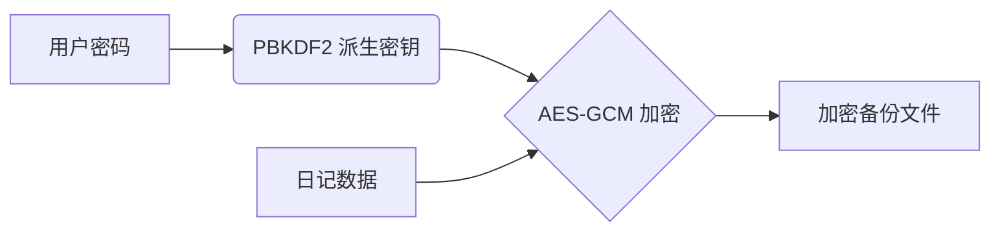

# 墨记 · Ink Diary

> 一款本地优先的 HTML 日记应用，支持多种编辑模式

<div align="center">


</div>

<div align="center">
  
  
  
</div>

## ✨ 核心特性

<table>
<tr>
<td width="33%">

### 📁 本地优先
所有数据存储在本地浏览器，不使用 AI 功能时可完全离线运行。

</td>
<td width="33%">

### 🔐 数据加密
使用现代加密算法保护您的日记内容，确保隐私安全。

</td>
<td width="33%">

### 🎯 多模式编辑
支持上传 HTML、直接编码，以及可选的 AI 辅助功能。

</td>
</tr>
</table>

## 🎨 设计理念

### 色彩体系
简洁、专注的配色方案，适合长时间书写和阅读

<div align="center">
  <table>
  <tr>
    <td align="center" width="100">
      <div style="width: 60px; height: 60px; background: #f8fafc; border: 1px solid #e2e8f0; border-radius: 8px;"></div>
      <br><b>主背景色</b><br>#f8fafc
    </td>
    <td align="center" width="100">
      <div style="width: 60px; height: 60px; background: #2d3748; border: 1px solid #e2e8f0; border-radius: 8px;"></div>
      <br><b>重点色</b><br>#2d3748
    </td>
    <td align="center" width="100">
      <div style="width: 60px; height: 60px; background: #4a5568; border: 1px solid #e2e8f0; border-radius: 8px;"></div>
      <br><b>次重点色</b><br>#4a5568
    </td>
    <td align="center" width="100">
      <div style="width: 60px; height: 60px; background: #718096; border: 1px solid #e2e8f0; border-radius: 8px;"></div>
      <br><b>辅助色</b><br>#718096
    </td>
  </tr>
  </table>
</div>

### 字体
- **主字体**: 系统默认字体栈，确保最佳可读性
- **备用字体**: [霞鹜文楷](https://github.com/lxgw/LxgwWenKai)（可选安装）

## 🚀 快速开始

### 方法一：使用批处理文件（推荐）

#### 🟢 简单启动（已安装 Node.js）
```bash
双击运行 `启动墨记应用.bat`
```

#### 🟡 完整启动（未安装 Node.js）
```bash
双击运行 `start-ink-diary.bat`
```
> 自动检测并安装所需环境

### 方法二：手动启动

#### 环境要求
- Node.js 18.0+
- npm 8.0+

```bash
# 克隆项目
git clone https://github.com/yourusername/ink-diary.git
cd ink-diary

# 安装依赖
npm install

# 启动开发服务器
npm run dev

# 构建生产版本
npm run build

# 预览生产构建
npm run preview
```

## 📱 功能模块

### 📚 日记列表 (DiaryList)
- 网格/列表展示所有日记
- 智能搜索与排序
- 内容预览与快速访问

### 👁️ 日记阅读器 (DiaryReader)
- 安全沙盒渲染 HTML 内容
- 简洁的阅读界面
- 编辑和管理入口
- 上一篇/下一篇导航

### ✍️ 日记编辑器 (DiaryEditor)
<table>
<tr>
<td width="33%">

#### 上传模式
- 拖拽或选择 HTML 文件
- 自动提取内容预览
- 支持文件批量上传

</td>
<td width="33%">

#### 代码模式
- 直接编写 HTML/CSS/JS
- 实时预览效果
- 代码高亮和格式化

</td>
<td width="33%">

#### AI 模式（可选）
- 需要配置 API 密钥
- 辅助内容润色
- 可自定义提示词

</td>
</tr>
</table>

### ⚙️ 设置 (Settings)
- **AI 配置**（可选）：Base URL、API Key、模型选择
- **本地安全**：设置加密密码，保护数据隐私
- **数据管理**：加密导出/导入、清空数据

## 🔐 安全架构

<table>
<tr>
<td>

### 🛡️ 本地数据加密
- 日记内容使用 **AES-GCM** 算法加密
- API Key 等敏感信息单独加密存储
- 可选的密码保护功能

</td>
<td>

### 📦 数据存储策略
- 所有数据存储在 **IndexedDB**
- 沙盒隔离渲染用户 HTML 内容
- 加密备份使用 PBKDF2 派生密钥

</td>
</tr>
</table>

### 🔒 加密备份流程


## 📝 使用指南

### 离线使用流程
1. **下载应用** → 构建后可作为 PWA 安装到桌面
2. **创建日记** → 使用上传或代码模式
3. **编辑内容** → 完全本地操作，无需网络
4. **阅读管理** → 所有功能均可离线使用

### AI 功能说明
```yaml
AI功能:
  性质: 可选附加功能
  要求: 需配置有效的API密钥
  网络: 使用时需要互联网连接
  注意: 不使用AI功能时可完全离线运行
```

### 数据备份与恢复
<table>
<tr>
<td>

#### 📤 加密导出
1. 进入"设置" → "数据管理"
2. 点击"导出"
3. 设置导出密码（至少6位）
4. 下载加密备份文件

</td>
<td>

#### 📥 密码导入
1. 选择加密备份文件
2. 输入解密密码
3. 系统智能合并重复内容
4. 查看导入结果统计

</td>
</tr>
</table>

### 三种编辑模式对比

| 功能特性 | 上传模式 | 代码模式 | AI模式 |
|---------|---------|---------|--------|
| 网络需求 | 仅上传时需要 | 不需要 | 需要 |
| 技术要求 | 低 | 中 | 低 |
| 灵活性 | 中 | 高 | 中 |
| 内容来源 | 现有HTML文件 | 手工编写 | AI生成+编辑 |
| 完全离线 | ✓ | ✓ | ✗ |

## 🛠️ 技术栈

<div align="center">
  
</div>

- **框架**: Vue 3 (Composition API)
- **构建工具**: Vite
- **样式**: Tailwind CSS
- **状态管理**: Pinia
- **数据存储**: localForage
- **加密**: Web Crypto API
- **PWA**: Vite PWA Plugin

## 📁 项目结构

```
ink-diary/
├── public/              # 静态资源
├── src/
│   ├── assets/         # 样式与字体
│   ├── components/     # 组件库
│   ├── modules/        # 核心模块
│   │   ├── db.js      # IndexedDB 操作
│   │   ├── ai-client.js # AI API 调用（可选）
│   │   └── crypto.js  # 加密模块
│   └── views/         # 页面视图
├── manifest.json       # PWA 配置
├── service-worker.js   # 离线缓存
└── vite.config.js     # 构建配置
```

## ⚠️ 重要声明

<div align="center" style="background: #f8f9fa; border: 1px solid #e9ecef; border-radius: 8px; padding: 20px; margin: 20px 0;">

### ⚠️ 核心说明

**关于离线功能和 AI 功能的明确说明：**

</div>

### 🌐 网络连接说明

1. **完全离线模式**：
   - **不使用 AI 功能时**：本应用可完全离线运行
   - 所有数据存储在本地浏览器
   - 所有编辑、阅读、管理功能无需网络
   - 加密备份功能也完全离线运行

2. **AI 功能网络要求**：
   - **需要互联网连接**
   - 需要有效的 API 密钥
   - 需要访问 AI 服务提供商的服务器
   - 不使用 AI 功能时不会产生网络流量

### 🛡️ 安全与隐私说明

#### 数据存储安全
1. **本地存储**：
   - 所有日记内容存储在您的浏览器 IndexedDB 中
   - 数据不会自动同步到云端
   - 清除浏览器数据将删除所有日记

2. **加密保护**：
   - 支持本地加密存储敏感内容
   - 加密备份可设置独立密码
   - 即使不设置密码，也使用应用内置密钥加密

#### 隐私保护
1. **AI 功能隐私**：
   - AI 请求直接从您的浏览器发送到 API 服务商
   - 不经过任何第三方服务器
   - 建议不要在 AI 请求中包含敏感信息

2. **内容安全**：
   - 用户上传的 HTML 在沙盒中渲染
   - 防止恶意脚本影响主应用
   - 建议仅上传可信任的来源

### 🤖 AI 功能使用说明

#### 功能定位
- AI 功能为**可选附加功能**
- 主要编辑模式为上传和代码编辑
- AI 功能旨在辅助创作，非核心功能

#### 使用建议
```markdown
推荐使用场景：
1. 文本润色和结构调整
2. 内容灵感激发
3. 格式美化建议

不建议用于：
1. 处理高度敏感信息
2. 生成法律、医疗等专业内容
3. 替代人工校对和审核
```

### 💻 技术注意事项

#### 浏览器要求
1. **现代浏览器**：
   - Chrome 80+
   - Firefox 75+
   - Safari 14+
   - Edge 80+

2. **功能支持**：
   - IndexedDB 支持数据存储
   - Web Crypto API 支持加密功能
   - Service Worker 支持 PWA 功能

#### 数据兼容性
1. **导入导出**：
   - 使用标准 JSON 格式
   - AES-GCM 加密保护
   - 兼容未来版本的数据迁移

2. **文件格式**：
   - 支持标准 HTML 文件
   - 保持原始代码格式
   - 支持常见 CSS 和 JavaScript

### 📊 功能对比表

| 特性 | 上传模式 | 代码模式 | AI模式 |
|-----|---------|---------|--------|
| **网络要求** | 不需要 | 不需要 | 需要 |
| **数据存储** | 本地加密 | 本地加密 | 本地加密+网络请求 |
| **隐私保护** | 高 | 高 | 中等（取决于API提供商） |
| **技术要求** | 低 | 中 | 低 |
| **完全离线** | ✓ | ✓ | ✗ |
| **推荐用途** | 已有HTML内容 | 自定义开发 | 内容辅助 |

### ⚖️ 责任与义务

#### 用户责任
1. **数据备份**：
   - 用户需自行定期备份重要数据
   - 建议使用加密导出功能创建备份
   - 重要数据建议多设备备份

2. **内容审查**：
   - 对上传或创建的内容负全部责任
   - AI 生成内容需人工审核
   - 遵守当地法律法规

#### 开发者声明
1. **功能保证**：
   - 不保证服务永久可用
   - 不保证数据绝对安全
   - 不提供技术支持承诺

2. **变更权利**：
   - 保留修改功能的权力
   - 可能停止维护或更新
   - 建议用户自行 fork 版本

### 🚨 使用建议

```yaml
最佳实践:
  1. 重要数据定期备份
  2. 使用强密码保护加密文件
  3. 不使用AI功能时可断开网络
  4. 在安全环境中处理敏感内容
  5. 测试备份文件的恢复功能

风险提示:
  - 浏览器数据可能被清除
  - 设备损坏可能导致数据丢失
  - AI服务可能变更或停止
  - 加密技术可能存在未知漏洞
```

### 📄 用户确认

**使用本应用前，请确认您已理解：**

1. ✓ 不使用 AI 功能时可完全离线运行
2. ✓ 所有数据存储在本地，清除浏览器数据将丢失
3. ✓ AI 功能需要网络连接和 API 密钥
4. ✓ 加密功能提供基础保护，但不能保证绝对安全
5. ✓ 您需要对备份数据负责

## 📄 许可证

本项目采用 [MIT 许可证](LICENSE) 开源。

```text
MIT License
Copyright (c) 2024 墨记 (Ink Diary)

允许自由使用、复制、修改、合并、发布、分发、再许可和/或销售本软件的副本...

THE SOFTWARE IS PROVIDED "AS IS", WITHOUT WARRANTY OF ANY KIND...
```

## 🙏 致谢

<div align="center">
  
感谢以下开源项目：

[](https://vuejs.org/)
[](https://vitejs.dev/)
[](https://tailwindcss.com/)
[](https://localforage.github.io/localForage/)

</div>

---

<div align="center">
  <h3 style="color: #2d3748; font-weight: 600; margin-bottom: 10px;">
    专注记录 · 简单可靠
  </h3>
  <p style="font-size: 0.9em; color: #718096; max-width: 600px; margin: 0 auto;">
    一个简单但强大的本地日记工具，在需要时提供AI辅助，
    在不需要时完全离线工作。
  </p>
  
  <hr style="border: none; height: 1px; background: linear-gradient(to right, transparent, #e2e8f0, transparent); margin: 20px 0;">
  
  <p style="font-size: 0.8em; color: #a0aec0;">
    📝 优先本地 · 可选AI · 数据自主
  </p>
</div>
